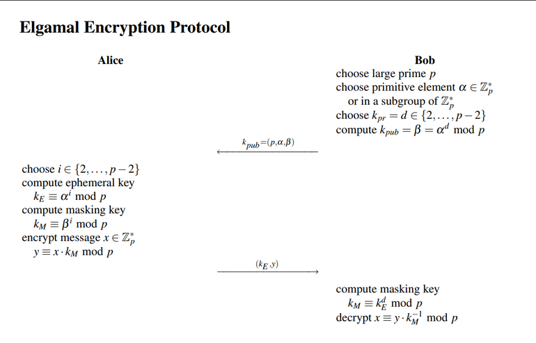

# Unit 3

## Assymetric Key Cryptography

- Trusted Key Distribution Center establish a shared secret key over the network
- Private and Public Key crypto will exist in parallel and continue to serve
- They are complements of each other
- Advantages of one can compensate for the disadvantages of the other
- ___Public Key:___ May be known by anybody, and can be used to encrypt messages
- ___Private Key:___ Known only to the recipient, used to decrypt messages and create signatures
- It is Asymmetric, because those who encrypt messages or verify signatures cannot decrypt the messages

### Why Public Key Cryptography?
- ___Key Distribution:___ How to have a secure communication in general without having to trust a KDC
- ___Digital Signatures:___ How to verify a message comes intact from the claimed sender
- Invented by:
  - Whitefield Diffie
  - Martin Hellman
  - Ralph Merkle
- Public Key alogs rely on two keys:
  - Computationally impossible to find decryption key knowing only algo and encryptio key
  - Computationally easy to en/decrypt messages when relevant key is known
  - Either of the two keys can be used for encryption, while the other is used for decryption
- The burden of security comes onto the reciever
- Reciever needs to create two keys, one private and one public
- Reciever is responsible for distributing the public key to the public

- This provides a good amount of Authentication and Secrecy
- ___Drawback:___ This public key algo is complex, and must be done 4 times rather than two times in each communication

### Requirements for Public-Key
- Computationally easy to generate a pair of keys
- Easy for a sender, knowing the public key and the plaintext to be encrypted, to generate the corresponding CipherText
- Computationally east for the reciever to decrypt the resulting ciphertext using the private key to retrieve the message
- Infeasible for anyone to get to know the private key if the public key is known
- Infeasible for anyone knowing the public key and a Cipher Text to retreive the original message


### Public Key Encryption Scheme
- It is a tuple of probabilistic polynomial-time alogrithms such that
  - Key generation Algorithm ___Gen___ takes as input the security parameter and outputs a pair of keys _pk_ and _sk_. These keys are are the public and private keys respectively
  - Encryption Algorithm ___Enc___ takes as input public key and message. It outputs ciphertext 'C'.
  - Decryption Algorithm ___Dec___ takes as input a private key _sk_ and a ciphertext _c_ and outputs a message _m_ in the case of success or a special symbol in the case of failure

### Private Key vs Public Key Cryptography

|Private Key Encryption|Public Key Encryption|
|:--:|:--:|
|Uses one key for encryption and decryption|Uses two keys, public and private|
|Key must be kept a secret|One key is a secret and the other can be freely exposed|
|Low power consumption|High power consumption|
|Speed in performace|Slow in performance|
|Inexpesive to generate|Expensive to generate|
|Randomly generated k-bit strings|Have special structures|
|Best  used for secrecy and integration of data|Best used key exchange and authentication|
|Key distribution is problematic|Key distribution is simple|
|Ex: AES, DES|Ex: Elliptic Curve, RSA, Diffie-Hellman key exchange|

### Public Key Applications
- Can classify uses into 3 categories
  - Encryption/Decryption (Provide secrecy)
  - Digital Signatures (Provide Authentication)
  - Key Exchange (of session keys)
- Some algos are suitable for all uses, others are specific to one


## Modular Arithmetic
- We are interested only in remainders over here, nothing else
- If `a` and `b` have the same remainder when divided by `n`, we show it as $`a \equiv b \pmod {n}`$
- A residue class of `r` denoted by `[r]` is the set of integers congruent modulo n

[r] = {x: x is an integer such that $`x \equiv r \pmod {n}`$ }

- Since there are n-1 possibilites of r, we get n-1 residue classes as modulo `n`
- We denote the set of all residue classes as Z<sub>n</sub>

- The three binary operators that we discussed for the set `Z` cal also be used for the set Z<sub>n</sub>

### Inverses
- When we work with modular arithmetic, we often need to find the inverse of a number relative to an operation
- Normally looking for an additive inverse or a multiplicative inverse

#### Additive inverse
```math
(a + b) \equiv 0 \pmod {n}
```
- Each integer has an additive inverse
- Sum of an integer and its additive inverse is 0 in modulo n

#### Multiplicative Inverse
```math
(a * b) \equiv 1 \pmod {n}
```
- An integer may or may not have a multiplicative inverse

- We need to use Z<sub>n</sub> when additive inverses are needed
- We need to use Z<sub>n</sub>* when multiplicative inverses are needed
- Z<sub>n</sub>* is the set where all the elements have a gcd of 1 with {n}

## Prime Numbers
- Prime numbers have only two divisors
- Largest known prime number is $`2<sup>82,589,933</sup> - 1`$. It has 24,862,048 digits
- Why primes?
  - It is fast to multiply two prime numbers, but it is computationally expensive to do prime factorize the large prime number

### Euler's Phi Function
- Euler's phi-function, called the Totient function plays a very important role
1. $`\phi(1) = 0`$
2. $`\phi(p) = p-1`$ if p is a prime
3. $`\phi(m x n) = \phi(m) x \phi(n)`$ if m and n are relatively prime
4. $`\phi(p^e) = p^e - p^{(e-1)}`$ if p is a prime

### Fermat's Little Theorem
- If `p` is prime and `a` is a positive integer not divisible by `p`, then $`a^(p-1) \equiv 1 \pmod {p} = 1`$

### Euler's Theorem
1. $`a^{(f(n))} \equiv 1 \pmod {n} = 1`$
2. $`a^{(k * f(n) + 1)} \equiv a \pmod {n} = 1`$
- The second version is used in the RSA Algorithm

### Primitive Roots
- Primitive Root of a prime number `n` is an integer `r` between [1, n-1] such that the values of $`r^(x(modn))`$ where x is in the range [0, n-2] are different
- Basically, when the number `a` is raised to a power `i` that is in the range of mod(n), then all the values in the range of mod(n) must appear once

## RSA Algorithm
- It is the most widely used asymmetric cryptographic scheme
- Majorly used for:
  - Encryption of small pieces of data
  - Key Transport
  - Digital Signatures
- ___Note:___ RSA is not meant to replace symmetric ciphers because it is several times slower than ciphers like AES. This is because of the large computation that takes place. So the main use is to securely exchange a key for a symmetric cipher. RSA is used with a cipher like AES, where AES carries the major bulk, and RSA just enables the key exchange

### Key Generation
- Require the computation of the pair (K<sub>pub</sub>, K<sub>pr</sub>)
- Steps involved in computin ght public and private key
  1. Choose two large prime numbers `p` and `q`
  2. Compute `n = p*q` and `z= (p-1)*(q-1)`
  3. Choose number `e` such that `e < n` and is coprime with z
  4. Find the number `d` such that (ed - 1) is exactly divisible by `z`
  5. Keys generated using n, d and e:
    - Public Key (n, e)
    - Private Key (n, d)

- ___RSA Encryption:___ Given the public key (n, e) = k<sub>pub</sub> and the plain text `x`, the given encryption function is:
```math
y = e_{k_pub} (x) \equiv x^e \pmod {n}
```

- ___RSA Decryption:___ Given the private key d = k<sub>pr</sub> and the cipher text `y`, the decryption function is
```math
x = d_{k_pr} (y) \equiv y^d \pmod {n}
```

- In practice, all the numbers x,y,n,d are all very long numbers, usually 1024 bits long
- The value `e` is referred to as __encryption exponent__ and `d` is usually known as __decryption exponent___

### Encryption and Decryption
1. Since an attacker has access to the public key, it must be computationally infeasible to determine the private-key `d` given the public-key values `e` and `n`
2. Since `x` is unique only up until the size of the modulus, we cannot encrypt more than 'l' bits, where 'l' is bit length of n
3. It should be relatively easy to calculate $`x^e mod(n)`$ and $`y^d mod(n)`$. This means that we need a method for fast exponentiation with very large numbers
4. For a given `n`, there should be many private-key/public-key pairs, otherwise an attacker might be able to perform a brute-force attack
5. Finding the modular multiplicative inverse for `e mod (p-1)*(q-1)` is a computationally hard problem when `p` and `q` are sufficiently large prime numbers
  - If it is easy to factor n into p and q, then they can compute `d` and break the security of RSA. Therefore the security of RSA relies on the difficulty of factoring n into p and q
6. Both RSA encryption and decryption are based on modular exponentiation
  - The efficiency and speed of raising these numbers to large powers then taking the modulo can lead to significant overhead

#### Square and Multiply
- It's kinda hard to sit and solve long mathematical operation
- Easier to mod right there after multiplying instead of doing the whoooole multiplication, then modding

##### Steps
- Convert exponent into binary
- Have a variable `r` that is your "accumulator"
- r = ((bit value) * (previous r value)) mod n
- If it is the first r, then r<sub>0</sub> is the base
 
## Diffie Hellman
- Key exchange protocol also known as exponential key exchange
- Enables 2 parties communicating over a public channel to establish a mutual secret
- Enables two communicating parties to use a public key to encrypt and decrypt data using symmetric key cryptography

- Steps:
  1. Select two numbers `P` and `Q`, where P is a prime number and Q is a primitve root of P
  2. Let `a` and `b` be private keys for Alice and Bob respectively
  3. Alice computes shared key as $`A = Q^a \pmod {P}`$ and sends A to Bob
  4. Bob computes shared key as $`B = Q^b \pmod {P}`$ and sends B to Alice
  5. Generate shared, private common key as follows
    - $`K_a = B^a \pmod {P}`$
    - $`K_b = A^b \pmod {P}`$
  6. It can be shown that $`K_a == K_b`

- Uses of Diffie-Hellman
  - Communication can take place through an insecure channel
  - Public Key Infrastructure (PKI)
  - Secure Socket Layer (SSL)
  - Transport Layer Security (TLS)
  - Secure Shell (SSH)
  - Internet Protocol Security (IPsec)

- Limitations of Diffie-Hellman
  - Does not authenticate either party involved
  - Cannot be used for
    - Assymetric exchange
    - Encrypting messages
    - Digital Signing
  - Sensitive to Man in the Middle Attacks

## Elgamal Encryption
- Almost same as Diffie-Hellman
- Alice uses the Shared Key as a multiplicative mask to encrypt the plain text

```math
y \equiv (x \times K_m) \pmod {P}
```

- Protocol consists of two phases
  - DHKE
  - Followed by Message encryption decryption
- The key pair for the reciever does not change, it can be used to encrypt many messages
- The sender however must generate a new public-private key pair for every message that is encrypted
- Alice's public key is very temporary
- For the actual encryption, Alice multiplies the plaintext message by the masking key $`K_m`$ in $`Z_p`$*
- On the reciever side, Bob reverses the encryption by multiplying the cipher text with the inverse mask

- Elgamal protocol has 3 phases
  1. ___Set-up Phase:___ Executed once by the party that issues the public key and the reciever of the message
  2. ___Encryption Phase:___ Encrypt the message
  3. ___Decryption Phase:___ ...Not much to be said here, Reciever decrypts the message
- No "Trusted Third Party" is needed to choose a prime and primitive element

- Elgamal  encryption protocol kinda rearranges the sequence, so that Alice will have to send only one message instead of two messages



- Cipher text consists of two parts, the Ephemeral (Temporary) Key and the Masked Plain text
- __Note:__ Ciphertext is twice as long as the plain text, thus the message expansion factor is 2
- Advantages of Elgamal over Diffie Hellman
  - Public Key of Bob is fixed and other values are chosen by him
  - It is a probabilistic encryption scheme
  - Encrypting two identical messages using the same public key results in different cipher texts


### Computational Analysis
- Square and Multiply Algo can be used for Key Generation to decrease compute time
- ___Encryption:___ Two modular exponentiations are required and one modular multiplication are required. One should apply square-and-multiply algorithm
- ___Decryption:___ Can convert both the steps (Exponentiation and Inversion of K) into one step thanks to Fermat's Little Theorem

### Attacks
- If Oscar _can_ compute DLPs, he will have two ways of attacking
1. Recover `x` by finding Bob's secret Key
2. Oscar could attempt to recover Alice's random exponent _i_
- To guarantee security from these attacks, _P_ should be at least 1024 bits long

## Elliptic Curve Cryptography
- Polynomial equation of an elliptic curve
- We are interested in elliptical curve modulo prime `p`

```math
y^2 \equiv x^3 + a \cdot x + b \pmod {p}
```

```math
4 \cdot a^3 + 27 \cdot b^2 \neq 0 \pmod {p}
```

- Elliptic Curve is symmetric over the __x-axis__
- Upto two solutions exists for each quadratic equation
- One in +y direction, the other in the -y direction
- For each point `P(x,y)`, the inverse/negative point is defined as `-P(x,-y)`

### Elliptic Curve Addition and Doubling

- If the points $`P(x_p,y_p)`$ and $`Q(x_q, y_q)$ are added and give the point $`R(x_r, y_r)`$, then th value of R is

```math
x_r = (s^2 - x_p - x_q) \pmod {p}
y_r = s(x_p - x_r) - y_p \pmod {p}

s = \frac{y_q - y_p}{x_q - x_p} \pmod {p} if P \neq Q
s = \frac{3 x_p^2 + a}{2 y_p} \pmod {p} if P == Q
```

## One Way Functions and Permutations

- A function whose output length is polynomially related to its input length is ___one-way___ if the following conditions hold
  1. Easy to compute
  2. Hard to Invert

- A tuple of probabilistic, polynomial-time algos is a ___family of functions___ if the following hold true:
  1. ___Parameter generation Algorithm (Gen)___ outputs parameters _I_. Each value of _I_ output by the Parameter Gen Algo defines the Domain and Range of a function, that is later defined
  2. The ___Sampling Algorithm__ on input I, outputs a uniformly distributed element of the Domain
  3. The deterministic ___Evaluation Algorithm___ on input I and x, belonging to Domain, output an element y belonging to the Range

  - This tuple is a ___family of permutations___ if for each value of _I_ (Output of the function Gen) holds that Domain = Range, and the function `f: D -> D` is a bijection


  
