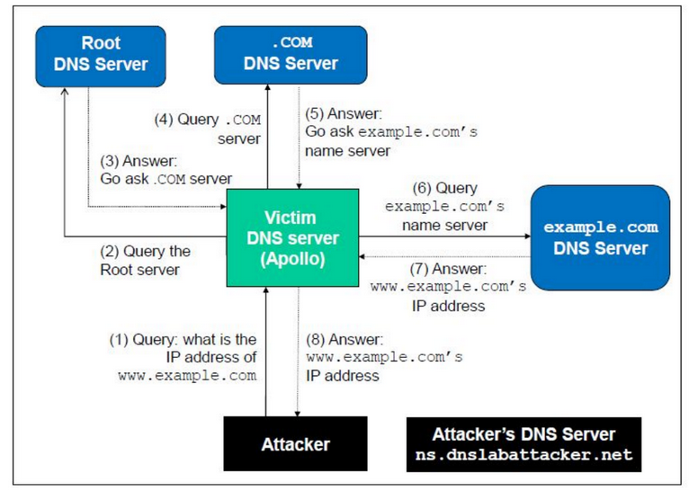

# Unit 3

## Remote DNS Attack
- ___Challenges:___ For remot attackers who are not on th same network as the local DNS Server, spoofing replies becomes much more difficult, as they cannot see the DNS Query
1. Attacker needs to guess:
  - Source port number (16-bit random number)
  - Transaction ID (16-bit random number)
  - Probability of a good guess is 1 in $`2^32`$
2. Time of spoofing:
  - How do you know when the DNS request is sent?
  - TO overcome this, we can trigger a request to the DNS server
3. Cache Effect:
  - If one attempt fails, then the actual reply will be cached by local DNS server
  - Attacker needs to wait for the cache to timeout for the next attempt
  - This waiting period can be hours, days or weeks
- Due to these challenges, remote attacks were considered not feasible

- To launch the attacks, we need to accomplish 3 tasks:
  1. Trigger DNS Server(Apollo) to send out the DNS Query
  2. Spoof the Reply
  3. Negate the Cache Effect
- Negating the Cache is the important part, as without that it is impossible to perform the attack

### What should be in spoofed reply?
- ___Kaminsky's Idea:___
  - Look away from the answer section
  - Use the authority section to provide nameserver
  - Tell Apollo that the name server for example.com is ns.attacker32.com (Attacker machine)
  - After this information is cached, Apollo will query the attacker's machine whenever it needs resolve a hostname in this domain

### What query should be used to trigger attack?
- The domain used in the authority section must be related the the query section
  - The query should be a host within example.com domain
- To trigger Apollo to keep sending queries, Apollo must be asked different questions
  - Query Apollo for a random name in example.com domain
  - Answer will not be in Apollo's cache, so it will query to the root server, then .com, then nameserver of example.com
  - While Apollo waits for the reply, attacker floods Apollo with stream of Spoofed DNS replies each with different Transaction ID and Port Number
- If the spoofed response fails, then the attacker will repeat the entire process, but use a different host name
- If attack successds, then the nameserver for example.com will be replaced by the attacker's nameserver

### Implementation

|Language|Code|Speed|
|:--:|:--:|:--:|
|__C/C++__|Difficult|High|
|__Python__|Easy|Low|

- Use a hybrid approach to launch the attack
- Use Python to construct the packet and use C to send out the pre-built packet

## Protection Against DNS Cache Poisoning

- Arnold writes a document
  - Doc is passed to a hashing algo and a digest is created
  - Digest is encrypted using Arnold's Private Key
    - This is known as Digital Signature
- Arnold sends the original document + Digital Signature to Jamie
- Jamie does the following
  - Hashes the document to a digest using the same hashing algorithm
  - Decrypts the Digital Signature using Arnold's Public Key and gets the digest
  - If the digests match, then the document actually came from Arnold, as the document was signed using Arnold's Private Key

### DNSSEC
- It is a set of extension to DNS
- DNSSEC strengthens the authentication and ensures data integrity in DNS using Digital Signature
- With DNSSEC, DNS data is signed by the owner of the data
  - All answers from DNSSEC protected zones are digitally signed
- DNSSEC allows a resolver of name server to verify the authenticity and integrity of DNS Response by establishing a _"chain of trust"_ to the source of DNS data and validating the digital signatures
- Cache poisoning will be defeated by this mechanism as any fake data will be detected because they will fail the signature checking
- To maintain data origint authenticity, both servers and resolvers should use DNSSEC

- ___Idea in simple:___
  - Every DNS Zone has a public/private key pair
  - Zone owner uses the private key to sign DNS data and generate digital signatures
  - "Private key" is known only to the zone owner
  - Public Key is published in the zone for anyone to retrieve

- ___Trusting DNSSEC Keys:___
  - Every zone publishes its Public Key
  - How can a resolver ensure that a zone's public key is authentic?
  - The public key is signed by the __parent zone's private key__
  - Just as a DNS Zone's parent is responisble for publishing a child zone's list of authoritative name servers, a zone's parent is also responsible for vouching for the authenticity of its child zone's public key
  - Every zone's public key is signed by its parent zone, except for the root zone

- ___Root Zone's Public Key___
  - Root zone's public key is an important starting point for validating  DNS data
  - Sequence of cryptographic keys signing other cryptographic keys is called a __chain of trust__
  - The public key at the beginning of a chain is called as __trust anchor__
  - Most resolvers are configured with just one anchor
  - By trusting this key at the top of the DNS Hierarchy, a resolver can build a chain of trust to any location in the DNS name space

#### Terminology
- A nameserver digitally signs a zone with 2 key pairs
  - Zone signing key: Used to sign/verify the records
  - Key signing key: Used to sign/verify the zone keys

- DNSSEC Resource Record Types:
  - DNS Public Key Resource Records: Holds the Public Zone signing key and Public Key signing key
  - Resource Record Signature(RRSIG): RR sets digitally signed by either PrivateZSK or PrivateKSK
  - Next Secure records(NSEC/NSEC3): Next nameserver to refer to
  - Delegation Signer Resource Records(DSRR): To authenticate PublicKSK of child zone. Has the hash digest of the child zone's PubKSK

#### DNSSEC Working
- DNS Resolver initiates an iterative query to a Root Zone
- Root Zone replies to the DNS resolver with the five records:
  1. NSEC RR for the next name server
  2. DNSKEY RR set for root zone
  3. RRSIG of above DNSKEY RR set signed by root's PrivateKSK
  4. DSRR for the zone
  5. RRSIG of above DS RR signed by Root's PvtZSK
- On receiving the above RRs from the Root Zone, the resolver
  - Verifies the RR sets using the Root's PubKSK
    - Get the root's PubKSK and PubZSK from DNSKEY RR
  - Verifies the Root Zone
    - DNS resolver has a trusted copy of root zone's PubKSK
    - Decrypts the RRSig record containing the DS Record using PubZSK
- DNS resolver now initiates a query to a .net/.com/.in zone
- .net/.com zone replies to DNS resolver with the 4 Resource Records
  - You get everything except for the first one
- On receiving the above RRs from example.net zone, the DNS resolver
  - Verifies the records
  - Verifies the zone
- On successful authentication, the DNS resolver replies the user with the IP address of the website being requested

#### Purpose of DNSSEC
- It is to authenticate DNS responses to prevent spoofing
- Recursive DNS server has a validating mechanism to verify the answer before storing it in its cache
- With DNSSEC enables, the authoritative DNS server with security signatures that can be fully validated up until the root, making it nearly impossible to spoof
- The attacker will have to spoof example.com, .com and the root server in order for the recursive server to accept the forged answer into its cache

### TLS/SSL
- ___HTTP:___ Protocol used for viewing web pages
  - All info is sent over the publlic internet in plain/clear text, which can be easily captured
- ___HTTPS:___ HTTP + Security Feature
  - Encrypts daata and ensures data protection
  - Protects using TLS/SSL

- ___SSL:___
  - When a computer connects to a website using SSL, the web browser will ask the website the identity
  - Website sends a copy of its SSL certificate to the Computer's Web Browser
    - If it is trustworthy, then the browser sends an OK message to the server
    - Web server responds with an ACK to the browser
    - SSL session proceeds and the encrypted data gets exchanged
  - ___TLS is the successor to SSL___
  - SSL uses both Symmetric and Asymmetric
    - Public Key Authority is the set of hardware, software, people, policies etc that are needed to create, manage, distribute and store digital certificates
    - PKI is also what binds keys with users
      - A Certificate Authority is a trusted third party entity that issues digital certs and manages public keys
    - In SSL comms, the server's SSL contains an assymetric public and private key pair
    - Session key that is created during the SSL Handshake is symmetric

### DNSSEC vs TLS/SSl
- Both are based on public key technology, but chains of trust are different
- DNSSEC provides chain of trust using DNS zone hierarchy, so name servers in parten zones vouch for the child zones
- TLS/SSL relies on Public Key Infrastructure which contains Certificate Authorities vouching for other computers

## Firewalls
- Firewall is a netowrk security device or a software that monitors incoming and outgoing network traffic and blocks traffic based on the rulesets
- First line of defence for over 25 years
- Establish a barrier between secured and controlled internal networks and the untrusted outside world
- Firewall makes a decision based on the rules in the ruleset
- __A firewall is only as good as its ruleset__

### Firewall Actions
- __Allow/Accept:__ Allowed to enter into the connected network/host through the firewall
- __Deny/Dropped:__ Not permitted to enter into the other side of the firewall
- __Rejected:__ Similar to deny, but an attempt will be made to tell the source about the decision through a specifically crafted ICMP packet
- _Ingress Filter:_ Inspects the incoming traffic
- _Egress Filter:_ Insepcts the traffic leaving the network and prevent people to access the outisde network

### Firewall Location
- Network zone is an administrative name for a colleciton of systems that require the same access control policy
- To secure a network, divide the network into managable zones, divided based on types of information contained inside the zone and who needs to acces it
- Place firewalls between the zones and implement access controls between the zones
- All firewalls monitor all traffic, either on network or on individual machine
- Firewalls can be placed anywhere on a network
  - External boundary firewall is placed at the edge of a local or enterprise network, just inside the boundary router
  - One or more internal firewalls acn protect the bulk of the organization network
- ___Host based firewalls:___
  - Software on a host that provides traffic control for that physical host
    - Inspect traffic before it is allowed to interact with any other applications on that host
    - Firewall capabilities are usually part of the OS running on the host
- ___Network based firewalls:___
  - Devices placed in-path in the netowrk with the intent of controlling packet flows
    - Provide protection for usually more than one device
    - Almost always hardware device with multiple network interfaces
    - Firewall functionality can be implemented as a software module in a router or LAN switch

### Demilitarized Zone
- The DMZ functions as a small, isolated network positioned between the Internet and the private network
- Any service that is being provided to users on the external network can be placed in the DMZ
  - Web servers
  - Mail servers
  - FTP server
- Neither as secure as the internal network, nor as insecure as the public
- Hosts in the DMZ are only allowed to have limited connectivity to specific hosts in the internal network
- Provides three layers of protection:
  - Has to penetrate the outside, router, bastion host(proxy), and the inside firewall router devices
- Since the outside router advertises only the DMZ, it appears as though the private network is __invisible__
- Since the inside routers advertise the DMZ only to the private network, systems do not have outside internet acsess and they have to use the bastion station to reach the external internet
- As DMZ is on a different network, a NAT can be installed on the bastion host to eliminate the need to renumber of re-subnet the private network

### Bastion Host
- Dedicated server that lets authorized users access a private network from an external network
- Bastion host performs authentication and proxy functions
- Placed outside the firewall or within a DMZ. it becomes the only ingress path to the internal resources
- Any single-purpose server providing access control could be a bastion host
- Systems face the internet, and hence need to be on the public side of of a firewall or DMZ
- They may provide authorized users access to certain internal resources

### Firewall Placement
1. ___Single Firewall:___
  - Single Firewall with at least 3 network interfaces, one from the public internet, one to DMZ, one to Internal Network
  - It is a single point of failure, as all the network has to go through there
2. ___Dual Firewall:___
  - First firewall is placed between the DMZ and the external network
  - Second one is placed between the DMZ and the internal network
  - This setup is more secure as there has to be a breach in both firewalls to reach the internal network
  -  Internal firewalls provide three purposes:
    1. Add more strict filtering capability
    2. Provides two way protection wrt DMZ
      - Protects the Internal network if the DMZ is compromised
      - Protects DMZ from attack from the internal network
    3. Multiple internal firewalls can be used to protect portions of the internal network
3. ___Distributed Firewall:___
  - Involves stand-alone firewalls devices plus host-based firewall working together
  - Admins can configure host-resident firewalls on hundreds of servers and workstations
    - These protect against internal attacks and provide protection tailored machines
  - Stand alone firewalls provide global protection, including internal firewalls and an external firewall
  - One can establish both internal and external DMZ
    - Web servers that need less protection, have less crit info, could be placed in an external DMZ outside the external firewall
    - Host based firewalls can be used on these Web Servers

### Design of Firewalls
- ___Firewall Policy:___
  - Dictates how firewalls should handle network traffic for specific IP based on the organization's info and security policies
  - Before making a firewall policy, risk analysis should be performed to find out what kind of traffic is needed by the organization and categorize them into how they should be treated by firewall
  - Risk Analysis is based on evaluation of threats, vulnerabilities, countermeasures
  - Firewall policy should be documented in the system security place and maintained and updated as frequently as possible
- ___Goals of a Firewall:___
  - Only authorized traffic should be allowed to pass through
  - All the traffic between the trust zones should pass through
  - Firewall must be immune to penetration, which implies using a hardened system with secured Operating Systems

### Zero Trust Architecture
- Eliminate Implicit Trust
- "Never trust, Always verify"
- Based on the realization that traditional security models operate on the outdated assumption that everything inside should be implicitly trusted
- With work being pushed to the cloud, taking a Zero Trust Architecture has become critical
- __If done correctly, Zero Trust results in higher overall levels of security__

### Sensible Firewall Policy
- A sensible firewall policy should
  - Default to blocking traffic
  - Driven by institutional policy
  - Directly linked to a natural-language policy
  - Defined in simple straightforward terms
  - Reusable objects
  - Descriptive comments
- Default deny is preferred default
  - Impractical in making default allow, because it has to check each condition for deny
  - Instead, write what you want to allow, and block everything else
  - Makes auditing the firewall much easier

#### Characteristics used by a Firewall Access Policy
- IP Address and Protocol Values
- Application Protocol
- User Identity
- Network Activity

#### Firewall Policy
- ___User Control:___ Controls access to the data based on the role of the user who is attempting to access it. APplied inside the firewall perimeter
- ___Service Control:___ Controls access by type of service offered by the host. Applied on the basis of netowrk address, protocol or connection
- ___Direction control:___ Determines the direction in which requests may be initiated and are allowed ot flow through the firewall

### Types of Firewalls
1. Packet Filter/Stateless Filter
2. Stateful Firewall
3. Application/Proxy Firewall
4. Next-gen Firewall

#### Packet Filter
- Operate at points where routers work
  - Administrator can define rules to manage allowed ports and IP Addresses
- Compare each packet to a set of established criteria like:
  - Allowed IP Address
  - Packet type
  - Port number
  - Other aspects of the packet protocol headers
- Stateless as it performs per packet
- Access Control List filter traffic as it passes through a router or switch
- ACLs consist of the desired action and one or more of:
  - Source address
  - Destination address
  - Protocol
  - Source/destination port

