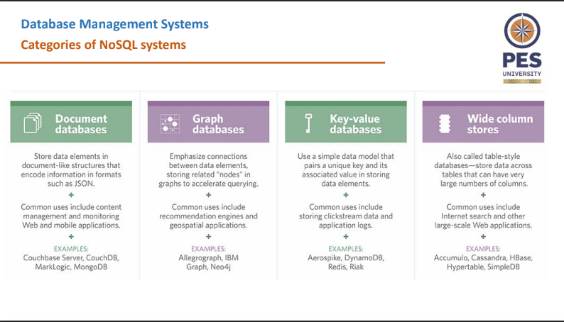

# Unit 4 notes

## Why Python?
- Programming in Python is efficient and faster
- Portability
- Python supports SQL Cursor
- Python supports RDBMS

- connection.commit() commits the changes to the database
- cursor.fetchone() fetches the next row from the result set
- cursor.fetchall() Fetches all the rows from the reusult query

- Always end with cursor.close() and connection.close()

## XML
- XML: Extensible Markup Language
- XML is a self-describing document
- Semantic tag names convey the meaning of data and understanding
- Basic Unit of data is the XML Document
- Does not limit the depth of the tree

### Types of XML Files
- __Data-centric__: Smamll data items that follow a specific structure and _may be_ extracted from a structured DB. Predefined schema that defines the tag names
- __Document-Centric__: Documents that have large number of text. Few or no structured data elements in these docs
- __Hybrid__: Parts that contain structured and other parts that are unstructured. May or may not have a predefined schema

## Semistructured Data
- Type of data that does not conform to rigid, predefined structure, but possess some level of organization
- Directed graphs
- __Internal Nodes__: Individual object or composite attributes
- __Leaf Nodes__: Atomic Values

### Differences between Semistructured Data and Structured Data
- __Schema Mixing__: Information about structure is mixed with actual data in the same structure
- __Schema Flexibility__: Semistructured does not have a blueprint that defines on how data should be organized, allowing flexibility

## NoSQL Databases
- Not Only SQL Databases
- Non-tabular databases
- Main types are:
  - Document
  - Key-Value
  - Wide-Column
  - Graph
- Defining schema became hard as data is now in all shapes and sizes

- Characteristics can be divided into two categories:
  - Related to distributed databases and distributed systems
  - Related to data models and query langauges

### NoSQL related to Distributed Databases
- __Scalability__: Horizontal Scaling is employed
- __Availability, Replication__: Many systems that use NoSQL need continuous availability. Data is replicated over two or more nodes
- __Replication Models__:
  - Master-Slave replication: Eventual copy
  - Master-Master replication: Not all might have the same data because read-write can be done on any of the copies
- __Sharding__: Sharding of the file records is done to distribute the load of accessing the file records. Combination of sharding and replicating the shrads works to balance load
- __High-Performance Data Access__: Hashing or Range Partitioning Keys

### CAP Theorem
- Can be used to explain some of the competing requirements in a distributed system
- Consistency, Availability, Partition Tolerance
- Theorem states that __"It is not possible to guarantee all three of the desirable properties at the same time in a distributed system without repliaction"__
- In SQL based, Consistency is through ACID properties is important
- In NoSQL based, a weaker consistency level is still acceptable

## MongoDB
- It is a document database
- Designed as a scalable database
- No schema
- Relational table row without schema
- Stores data as documents
- Consists of field-value pairs
- Documents are stored in BSON format
- _id is automatically created for every object
- Timestamp (4 bytes), Node ID (3 bytes), Process ID (2 bytes), Counter (3 bytes)

|RDBMS|Mongo|
|:---:|:---:|
|1. It is a relational db|Non-Relational, document oriented|
|2. Not suitable for hierarchical|Suitable for hierarchical|
|3. Increasing RAM|Increasing servers|
|4. Predefined schema|Dynamic Schema|
|5. Centers around ACID|Centers around CAP Theorem|
|6. Row based|Document based|
|7. Slower than Mongo|Almost 100x times faster than RDBMS|
|8. Supports complex joins|Does not support complex joins|

### CRUD Operations
- CRUD stands for: Create, Read, Update, Delete
- db.createCollection(name, options), creates a collection with the specific name. Options is optional
- db.collectionName.insert({document}) inserts the document/(s) in the collection
- db.collectionName.find({condition}) major read query
- //and =>, `or $and[{condition1}, {condition 2}]`
- //or => `$or:[{condition 1}, {condition 2}]`
- Since Mongo is distributed system, two-phase commit method is used to ensure atomicity and consistency
- db.collectionName.remove deletes

### Distributed Systems Characteristics
- Two ways to partition:
  - Range Partitioning
  - Hash Partitioning

- Shard key (Partitioning field) must have two characteristics:
  - It must exist in every document in the collection
  - It must have an index

- ___Range Partitioning:___
  - Creates the chunks by specifying a range of key values

- ___Hash Partitioning:___
  - Applies a hash function to each shard key K, and the partitioning of keys is based on the hash values

- Sharding and replication are used together
- Sharding focuses on improving performance via load balancing/scalability
- Replication focuses on system availability when certain nodes fail in the distributed system

## DynamoDB
- Focus on high performance, availability and scalability
- Simple data model and no query langauge, only a set of operations that can be used by application programmers
- __Key:__ Unique identifier associated with a data item and is used to locate the data item rapidly
- __Value:__ The data item itself and can have various formats

- Dynamo is part of Amazon's AWS
- Tables, Items and Attributes
- Table name and a Primary Key is required when creating the table
- Voldemort is a db that is based off of Dynamo
- It has been used by LinkedIn for storage

- ___Features:___
1. Simple basic operations:
  - Only 3 operations:
    - ___Get:___ Retrieves the value v associated with key "k"
    - ___Put:___ Insert an item as a key-value pair withe key "k" and value "v"
    - ___Delete:___ Deletes the item whose key is "k"

2. High-Level formatted data:
  - Values can be in JSON Format
  - Other formats can be specified if the apaplication provides conversion
  - Serializer class must be provided by the user

3. Consistent Hashing for distributing (key, value) pairs:
  - Variation of the data distribution algorithm is known as consistent hashing
  - Allows for horizontal scalability
  - Allows replication
  - Sharding is an in-built method

4. Consistency and Versioning:
  - Concurrent write operations are allowed by different processes
  - Two or more values can be associated with the same key at different nodes when items are replicated
  - Consistency is achieved when using a technique known as versioning and read repair

## Neo4j

- Neo4j is a Graph oriented db
- Implemented in Java
- Organizes data based on nodes and relationships
- Nodes can have labels and the ones with same label are grouped into a collection
- Relationships are directed: Each relationship has a start node and end node as well as relationship type
- Properties can be specified via a _map pattern_, which is made of one or more `"name: value"` pairs

|Neo4j|ER Diagram|
|:---:|:--------:|
|1. Relationship may be directed|Relationship is not directed|
|2. Node may have no label|Every entity must belong to an entity type, so node __should__ have a label|
|3. Graph model is used as a basis for high-performance distributed db system|ER/EER model is mainly used for db design|

- ___Path:___
  - Specifies a traversal of part of the graph
  - Part of a query to specify a pattern
  - Specified by a start node, one or more relationships, one or more end nodes

- ___Optional Schema:___
  - Schema is optional in Neo4j
  - Main features realted to schema creation involve creating indexers and constraints based on the labels and properties

- Neo4j has a High Query Language: __Cypher__
- Declarative commands for creating nodes and relationships
- Cypher query is made up of clauses

- ___Characteristics___:
  - Graph visualisation interface
  - Master-slave Replication
  - Caching
  - Logical Logs

## Steps in Query Processing
1. Parsing and Translation
2. Optimization
3. Evaluation

- Convert the given SQL query into relational algebra

- ___Query Evaluation Plan:___
  - We need to annotate the relational algebra with instructions specifying how to evalueate each operation
  - A relational algebra annotated with instructions is called an evaluation primitiev
  - Sequence of primitive operations that can be used is a `Query-Execution Plan`
  - Query-Execution Engine takes a query-evaluation plan that executes the plan, then returns the answer to the query

- ___Evaluation of Expressions___:
1. Materialization
2. Pipelining

- ___Materialization___:
  - Refers to the process of creating a physical, persistent copy of intermediate of final results
  - Performance Optimizaition: Avoiding the use of performing the same query when the intermediate value is already present
  - Concurrency: Materialized results can be shared among multiple users or queries concurrently

- ___Pipelining___:
  - Technique in which output of one stage is fed directly as the input to the next stage
  - Involves executing different stages in an overlapping manner
  - Reduced Latency: Significantly reduce the overall query execution time
  - Resource Efficiency: Resources are efficiently utilized, as each stage can start without waiting for the entire data to be processed

