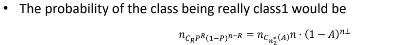
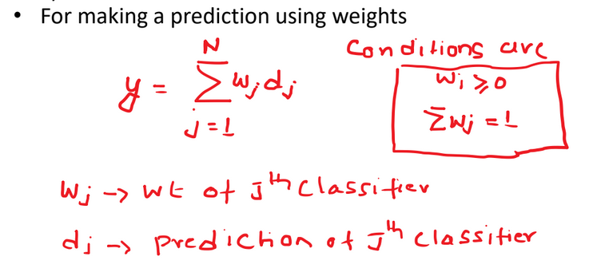

# Unit 3

## Ensemble Learning

- Is a technique that combines the predictions from multiple machine learning algos together
- It is used to make more accurate predictions then an individual model
- Learners that we use are ___weak learners___
- Comes at a cost of increased algorithmic and model complexity

### Key Idea 1

- We have learners where the output is just better than 50%, but not very high
- Multiple learners can be modelled using
  - Different Alogs
  - Different Hyperparameters on the same algorithm
  - Different subsets of the training data
  - Different features of the training data

### Key Idea 2

- Contruct multiple, diverse predictive models from adapted versions of the training data
- Combine the predictions of these models in some way, usually by weighted averaging or voting

### General Idea

- Decision Trees overfit, hence they have high variance
- Ensemble Learning ensures that the combined model of several weak learners have a less variance than the decision tree
- ___Averaging a set of observations reduces the variance___
- The errors must be made independent of each other

### Bias and Variance

- Model with High Bias is too simple and low predictors
- Pays little attention to the training data and oversimplifies the model
- High Error on Test and Training Data
- Model with High Variance is too complex and has too many predictors
- It cannot generalize this model to unseen data

- Low bias has high flexibility
- High Variance we give different subsets of training data
- More flexible representations have high Variance
- We want to have ___Low Bias and Low Variance___
- Basic models do not perform so well as they have high bias or too much variance

- Ensemble learning prevents overfitting

### Combining Ensemble Learners

- Learners can be unweighted
- Can be weighted to dj accuracy, 1/variance of the learner

- The critical point of ensemble learners is that they need to be independent
- Using either different subsets or sub learners

### Types of Ensemble Methods
- Manipulate data distribution
  - Example: Bagging, Boosting
- Manipulate input features
  - Example: Random Forests
- Manipulate class labels
  - Example: Error-Correcting output coding

### Bagging

- We can make different learners to have independent errors by splitting the data into subsets and passing them to different learners
- As we are splitting the data, dataset might be small and we may end up with high variance and overfitting
- Can randomly smaple from the dataset creating new datasets of the same size, or a very large fraction of the data set with replacement
- This method is called ___Bootstrap Aggregation___ or ___Bagging___
- We have close to 67% of data from the original dataset.

- Probability of Data __Not__ being selected = (1 - 1/n)n

- Multiple subsets are created from the original dataset
- A weak model is created on each of these subsets
- Final predictions are done by combining the predictions from all the models

#### Error Calculation

- Can do K-fold cross validation for error calculation

