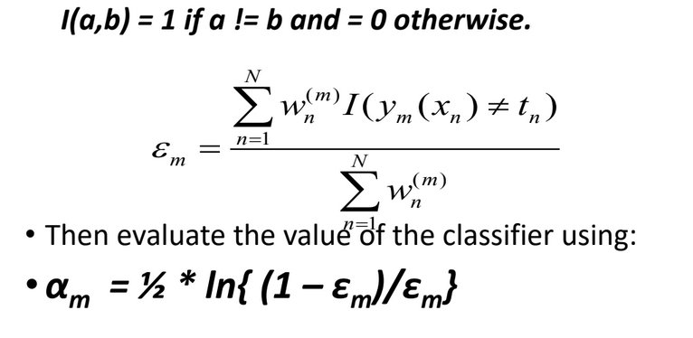
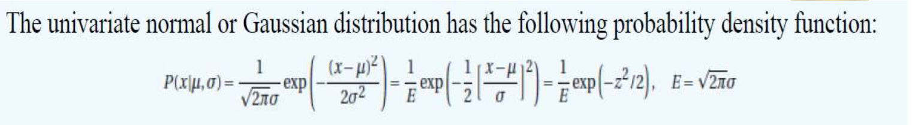

# Unit 3

## Ensemble Learning

- Is a technique that combines the predictions from multiple machine learning algos together
- It is used to make more accurate predictions then an individual model
- Learners that we use are ___weak learners___
- Comes at a cost of increased algorithmic and model complexity

### Key Idea 1

- We have learners where the output is just better than 50%, but not very high
- Multiple learners can be modelled using
  - Different Alogs
  - Different Hyperparameters on the same algorithm
  - Different subsets of the training data
  - Different features of the training data

### Key Idea 2

- Contruct multiple, diverse predictive models from adapted versions of the training data
- Combine the predictions of these models in some way, usually by weighted averaging or voting

### General Idea

- Decision Trees overfit, hence they have high variance
- Ensemble Learning ensures that the combined model of several weak learners have a less variance than the decision tree
- ___Averaging a set of observations reduces the variance___
- The errors must be made independent of each other

### Bias and Variance

- Model with High Bias is too simple and low predictors
- Pays little attention to the training data and oversimplifies the model
- High Error on Test and Training Data
- Model with High Variance is too complex and has too many predictors
- It cannot generalize this model to unseen data

- Low bias has high flexibility
- High Variance we give different subsets of training data
- More flexible representations have high Variance
- We want to have ___Low Bias and Low Variance___
- Basic models do not perform so well as they have high bias or too much variance

- Ensemble learning prevents overfitting

### Combining Ensemble Learners

- Learners can be unweighted
- Can be weighted to dj accuracy, 1/variance of the learner

- The critical point of ensemble learners is that they need to be independent
- Using either different subsets or sub learners

### Types of Ensemble Methods
- Manipulate data distribution
  - Example: Bagging, Boosting
- Manipulate input features
  - Example: Random Forests
- Manipulate class labels
  - Example: Error-Correcting output coding

## Bagging

- We can make different learners to have independent errors by splitting the data into subsets and passing them to different learners
- As we are splitting the data, dataset might be small and we may end up with high variance and overfitting
- Can randomly smaple from the dataset creating new datasets of the same size, or a very large fraction of the data set with replacement
- This method is called ___Bootstrap Aggregation___ or ___Bagging___
- We have close to 67% of data from the original dataset.

- Probability of Data __Not__ being selected = (1 - 1/n)n

- Multiple subsets are created from the original dataset
- A weak model is created on each of these subsets
- Final predictions are done by combining the predictions from all the models

#### Error Calculation

- Can do K-fold cross validation for error calculation
- Usually 1/3 of the samples are left out in every subset
- These 1/3 samples are called "Out of the Bag Samples"
- Measure the error on the unused samples
- Average that error
- Average of the error gives us the error for that sample
- Accumulate the overall error of the "Out of Bag Samples" and find average
- This error calculation is close to the leave out one approach

- ___About 100 learners are enough___

## Boosting

- Let different learners ahve different weights
- These weights can be stated by accuracy or variance
- Let each learner progressively learn from the previous learner
- Learner 2 can make mistakes, but it is told to learn from Learner 1's mistakes and not repeat them again
- Make sure that all the weights add up to 1

|Boosting|Bagging|
|:------:|:-----:|
|1. Observations are weighted and therefore some will take part in the new set more often|Any element has the same probability to appear in a new data set|

- One of the most popular boosting technique is ___Adaboost___
- Use a weak learner called a decision stump
- One node and based the values it does a binary split
- Boosting this way so the model _learns slowly and incrementally_

- There is a chance to overfit

## Adaboost

- There is only 1 data set being used
- Initialize to the same normal weight, ie. 1/N, where N = Number of Instances
- Choose learner with highest accuracy
- Run the algorithm and collect the error rate = % of misclassified examples
- Ensure that the next learner does not misclassify the points that the first learner made a mistake on
- Continue until satisfied
- Finally take a vote of all the hypothesis (weighted) and state the hypothesis
- There are 2 weights: ___Instance Weight and Hypothesis Weight___

- Sum of weight * loss column stores the total error
- Compute the stump weight

- The main selling point of Adaboost is that the next learner learns frmo the mistakes of the previous
- We do this by increasing the weights of the instances that got it wrong and reduce the weights of the instances that got it right

- When the error rate is 0, alpha is close to infinity
- If the error rate is 0.5, the alpha value is zero, because it's as good as a coin toss
- If error rate is 1, then everything has been classified incorrectly and the alpha value is -infinity

## Gradient Boost

- It is an ensemble Algorithm
- Single constituent models may suffer from high variance and high noise
- Combining their results would result in a value that is generally more accurate than individual values
- Gradient Boost starts by making a single leaf, not a tree or stump
- The first guess is always the average value
- Gradient Boost builds a tree using the errors of the previous tree
- Each tree is more than a stump
- How to predict weight:
  - Step 1: Calculate average of all weights
  - Step 2: Calculate the errors from the previous stump by calculating difference
  - Step 3: Replacee the values at the leaves with their averages in case of multiple values
  - Step 4: Combine the original tree with the new tree to get a new predicted weight for the same data
  - Step 5: Calculate the residuals once again using the predicted values from the previous steps
  - Step 6: Build a new tree
  - Step 7: Add new tree to the previous trees along with the scaling factor
  - Step 8: Calculate new residual values
- It will have low bias and high variance
- This is where ___Learning Rate___ comes into play
- Learning rate is a value between 0 and 1

## GMM
- Initialize parameters
- E-Step: Calculate the posterior distribution of latent variables
- M-Step: Update the Parameters
- Repeat E and M until convergence
- Converges to some local optimum

- Applications:
  - Estimating parameters od a GMM
  - Baum Welch Algo in HMM
  - Clustering

- Why GMMs?
  - By modifying the mean and variance, it can be made to look like an ellipse
  - Using GMM, we can build clusters in any elliptical shape
  - GMM is a soft clustering algorithm, it's more flexible than K-Means
  - Power of the Gaussian distribution, thanks to Central Limit Theorem

- Select one among K Gaussians according to prior distribution
- Generate a random data instance from the selected Gaussian

## HMM
- A random sample can be thought of as a set of objects that are chosen randomly
- ___Random Sample:___ "A Sequence of Independent, Identical Distributed Random Variables"
- ___Identical Distributed___ means that there are no overall trends
- ___Independent___ means that the sample items are all independent events, they are not connected to each other in any way
- The IID assumption that we make during Naive Bayes is an ___assumption___. It does not hold good in many cases

- Modelling is done with the help of Finite State Machines
- State Machines usually have a start, end state, alphabet that takes you to a new state
- Alphabets can be thought of the change in conditions that cause a state transition
- In Modelling Markov Process, there is ___NO SPECIFIC___ start state

### Discrete Markov Process (Markov Chain)
- Start state is not defined
- Stochastic process over a discrete state space
- Proabability on moving from one state to the next depends only on the present state and nothing else
- Irreducible if we can reach any state from any other state

- A Markov chain is specified by the following components:
  - A set of states
  - A transition probability matrix
  - A special start and end state which are not related to the observations

### Hidden State
- The underlying hidden variable that represents the state of the system at any point
- We assumed that the instancecs that constitute a sample are IID
- But this is not the case usually

- HMM models a process with a First Order Markov process
- It includes the state distribution
- Transition probabilities
- Contains the likelihood B of the observation given a hidden state
- Matrix B is called emission probabilities

- HMMs are augmentation of Markov Chains
- Markov Chain is simplest Markov Model
- HMMs are sequence classifiers

- Two major assumptions are made in HMM:
  - The next state and current observation solely depend on the current state only

- 3 Fundamental problems:
  - Likelihood
  - Decoding
  - Learning

### Forward Algorithm

- Objective:
  - Calculae probability of observing a speicific sequence

- Initialization:
  - We calculate the initial probabilities for each hidden state.
  - These initial probabilites are determined by the product of initial state distribution and the emission probability

- Recursion:
  - We iteratively calculate the probabilites of being in each state at that time
  - Recursion step effectively propogates the probabilites through time

- Termination:
  - Probability of observing the entire sequence is obtained by summing the forward probabilites for all possible states at the final time step
  - Final probability represents the likelihood of observing the given sequence according to the HMM
  

## Unsupervised Learning
- Don't have a target variable to predicts
- Only have independent variables
- Divide entire data into a set of groups
- Groups are called clusters, and the process is called clustering
- Intra cluster distance is minimized, inter-cluster distances are maximized

### Clustering
- Hierarchical
- Partitional
- Density based
- Grid Based

#### Hierarchical
- We move based on some hierarchy and combine the data points
- If you don't terminate, then you will get one item in each cluster, or all items in one cluster, depending on what algo you've chosen for clustering
- Agglomerative is when you combine points together
- Divisive is when you break apart the groups into smaller data points

##### Divisive
- Top-down strategy where we treat all the points as one large cluster.
- Using a termination criteria we partition the data into smaller groups
- Criteria is determined by factors like minimum sum of squared errors, after which no further division of data points occurs
- This algorithm is not flexible and once an operation is performed, it cannot be undone

##### Agglomerative
- Algorithm:
  1. COmpute proximity matrix
  2. Let each data point be a cluster
  3. Repeat
    4. Merge two closest clusters
    5. Update proximity matrix
  6. Until only one cluster remains

- Key operation is the computation of the proximity of two clusters
- Inter cluster similarity can be calculated by the following methods:
  - Min
  - Max
  - Group Average
  - Distance between centroids
  - Ward's Method(Squared error)
- Once a decision is made to combine two clusters, it cannot be undone
- Have problems with one or more:
  - Sensitivity to noise and outliers
  - Difficulty handling different sized clusters and convex shapes
  - Breaking large clusters

#### Difference between Hierarchical and Non-Hierarchical

|Hierarchical|Non-Hierarchical|
|:----------:|:--------------:|
|1. Involves creating clusters in a predefined order from top to bottom|Formation ofnew clusters by merging or splitting instead of a hierarchical order|
|2. Less reliable and slower|Faster and more reliable|
|3. Problematic to apply this technique when we have high error in data|Can work even when there is an error|
|4. Easier to read and understand|Difficult to read and understand|

#### K-Means Clustering
- Randomly assign k-centroids
- Find the distance from all points to all centroids
- Cluster the points that have the lowest distance to centroid
- Recompute the centroids
- Find distance between all points and new centroids, then make changes respectively
- Outliers badly imapct on K-Means clustering
- ___Pros:___ Easy to implement
- ___Cons:___ Can converge at local minima, slow on large data sets
- If n = number of points, K = number of clusters, I = number of iterations, d = number of attributes, then the complexity is of the order O(n* K * I * D)
- Eliminiate outliers before applying k means
- Use hierarchical clustering to determine initial centroids

#### Bisecting K-Means Clustering
- Set K to define the number of clusters
- Set all data as a single cluster
- Use k-means with k=2 to split the cluster
- Measure distance for each intra cluster
- Select the cluster with largest distance and split that into 2 clusters again

#### K-Means as Expectation Maximization
- E-step is assigning the data points to the closest cluster
- M-step is computing the centroid of each cluster

## Genetic Algorithms
- Metaheuristic search-based optimization technique
- Optimal or near-optimal solution
- Avoids local optima, because it looks at global perspective of the solution space
- Fitness function: Solution as input and produces the suitability of solution as output
- Genetic operators: Alter genetic composition of offspring. Crossover, mutation etc
- A pool of possible solutions is considered
- Recombination and mutation to produce new offsprings
- Process is repeated over various generations
- Solutions "evolve" until a stopping criteria is met
- GAs deal with encoded representation of the solutions and not the solutions directly
- Prefer to use binary, if can't use binary then go for Real valued notation, and if it discrete values that _can't_ be in binary, use integers
- GAs are not suited for all problems, especially problems which are simplee nad for which derivative information is available
- Fitness value computation is expensive
- No guarantees on the optimality or quality of solution
- Convergence may not happen in some cases

- ___Steady State:___
  - Generate one or two offsprings in each iteration and they replace one or two individuals from the population

- ___Generational:___
  - Generate 'n' offsprings where n is the population size and the entire population is replaced by the new population

- Fitness function defines the criteria for ranking potential hypotheses and for probabilistically selecting them for inclusion in the next gen population
- Fitness function should have the characteristics:
  - Fast enough to compute
  - Measure how fit a given solution is or how fit individuals can be produced from the given solution

- Roulette wheel to select parents:
  - Spin the wheel, the region that comes in front of the fixed point is one parent, do the same for the second parent

- Stochastic Universal Sampling:
  - Same as roulette, but have multiple fixed points

- Tournament Selection:
  - Selet K individulas from the population
  - Choose the best parent of them all

- Rank Selection:
  - Individuals have very close fitness values
  - Selection of the parent depends on rank, not on the fitness
  - Higher ranked values are preferred more than lower ranked

- Random Selection:
  - Randomly select parents from existing population

- There are three types of Crossovers:
  1. Convex
  2. Affine
  3. Linear

- Convex Crossover:
  - Average or Intermediate crossover if alpha = beta = 0.5

- Affine Crossover:
  - alpha = 1.5 and beta = -0.5

- Linear crossover:
  - When alpha and beta are strictly restricted as alpha + beta <=2 and beta>0, alpha>0

- Mutation:
  - Alters one or more gene values in a chromosome from its initial state
  - Prevents population becoming too similar to each other
  - Avoid local extreme
  - Development of un-inherited characteristics
  - Small random tweak in that chromosome to get a new solution
  - Used to maintain and introduce little diversity, and is applied with a low probability
  - If prob is very high, then GA reduces to a random search
  - Mutation is essential for convergence of GA, while crossover is not necessary
  - After crossover, the strings are subject to mutation

- Crossover Probability:
  - Measure of likeliness that the selected chromosomes will be undergoing crossover
- Crossover Rate:
  - Total number of crossovers that will be performed on the selected chromosomes
- Mutation Probability:
  - Measure of likeliness that random elements of the chromosome will be changed with something else
- Mutation Rate:
  - No. of chromosomes that will undergo the mutation out of the total population

|Genetic Algo|Genetic Programming|
|:----------:|:-----------------:|
|1. Often produces invalid states|Each individual is a computer program|
|2. Probabilistic search algo|Explores the algorithmic search space and evolve computer program to perform a task|
|3. Has an output that is a quantity|Application of Genetic Algo|

