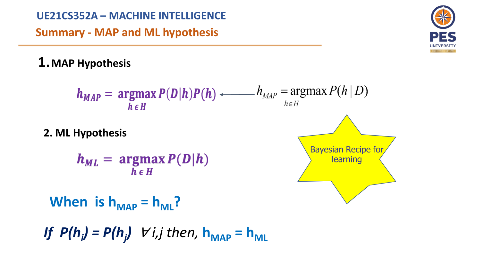

# Unit 4

## MAP Hypothesis
- Maximum a Posteriori is a Bayesian-Based approach to estimating a distribution and model parameter
- MAP involves calculating a conditional probability of observing the data given a model weighter by a prior probability or belief about the model
- Terms to remember:
  - h: A specific Hypothesis
  - H: Hypothesis space - Set of hypothesis

- hMAP = argmax _P(h|D)_
- ___Goal of Learning:___
  - Find a maximum a posteriori hypothesis

## Maximum Likelihood Hypothesis
- If every hypothesis in H is equally probable for all hi and hj in H
- hML = argmax P(D|h)
- hML is called the "maximum likelihood hypothesis"

## Bayesian Learning

- We first make some assumptions:
  1. Training space is conjunctive
  2. Training data is noise-free
  3. Target concept is in the hypothesis space
  4. All hypothesis are equally likely

- We have now prior knowledge to believe that any hypothesis is more probable than the other
- We assume the target concept is contained in H, we require all these prior probabilities sum up to 1
- Any consistent hypothesis has the same A Posteriory probability
- If you are using MAP, then any consistent hypothesis is fine

### Brute force MAP Learning
- As data is added, the certainity of the hypothesis increases
- Training:
  - Choose hypothesis with the highest posterior probability
- Testing:
  - Given x, compute hMAP(x) where x is a new data point
- Drawback:
  - Requires to compute all the probabilities P(D|h) and P(h)

### Naive Bayes Classifier
- Learning tasks where each instance x is described by a conjunction of attribute values and the data could be of one of the categories
- Label can be binary or multiple
- Performance can be compared to Neural Networks or Decision Tree

- Types:
  - Gaussian: Continuous Data, Classification and it assumes that features follow normal distribution
  - Multinomial: Discrete counts, ex: How often does this word occur?
  - Bernoulli: If feature vectors are binary in nature

- Instead of computing so many probabilities, we make an assumption that all features are independent
  - This is the ___naiveness___

- ___Summary:___
  - The Naive Bayes Classifier involves a learning step in which various terms are estimated based on their frequencies over training data
  - Set of these estimates corresponds to the learned hypothesis
  - Space of possible hypothesis is the space of possible values that can be assigned to various terms
  - Hypothesis is formed without searching, simply by counting the frequency of various data combinations within training examples

### Zero Frequency Problem
- If categorical variable has a catergory which was not observed in training data, then the model will assign a __0__ probability and will be unable to make a decision
- To solve this, we use the Smoothing Technique
- One of the most simple Smoothing Techniques is the Laplace Estimation

### Numerical Underflow Problem
- If all the values in the dataset are less than 1, then the product will be close to zero, if the number of elements in the dataset are very large
- To avoid this, Scale Up the values
- Work in a log space and manipulate the log od probabilities instead of the probabilities themselves

## Expectation Maximization
- Iterative way to learn maximum likelihood estimate of parameters
- Used when there are latent variables that affect the model's behavious

- Two steps:
1. E-Step: Latent variables are estimated, given the observed data, and the current estimate of the model parameters
2. M-Step: Likelihood function is maximized under the assumption that the missing data are known

- In E-Step, the missing data are estimated given the observed data and current estimate
- In M-Step, the likelihood function is maximized under the assumption that missing data is known
- Estimate of the missing data from the E-Step are used instead of the missing data

## K-Means Clustering
- Minimize intra-cluster distance
- Maximize inter-cluster distance

