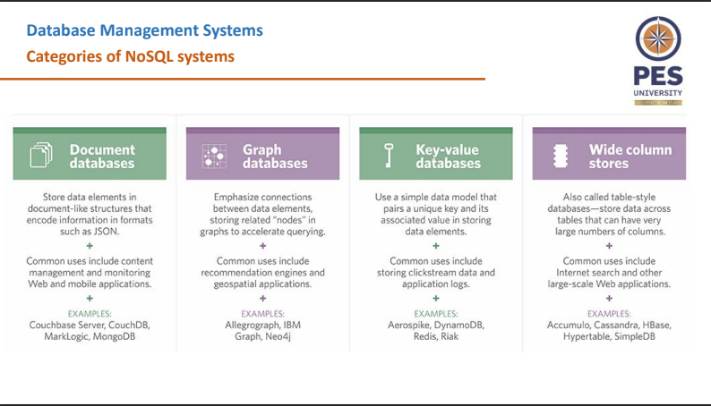

# Unit 4 notes

## Why Python?
- Programming in Python is efficient and faster
- Portability
- Python supports SQL Cursor
- Python supports RDBMS

- connection.commit() commits the changes to the database
- cursor.fetchone() fetches the next row from the result set
- cursor.fetchall() Fetches all the rows from the reusult query

- Always end with cursor.close() and connection.close()

## XML
- XML: Extensible Markup Language
- XML is a self-describing document
- Semantic tag names convey the meaning of data and understanding
- Basic Unit of data is the XML Document
- Does not limit the depth of the tree

### Types of XML Files
- __Data-centric__: Smamll data items that follow a specific structure and _may be_ extracted from a structured DB. Predefined schema that defines the tag names
- __Document-Centric__: Documents that have large number of text. Few or no structured data elements in these docs
- __Hybrid__: Parts that contain structured and other parts that are unstructured. May or may not have a predefined schema

## Semistructured Data
- Type of data that does not conform to rigid, predefined structure, but possess some level of organization
- Directed graphs
- __Internal Nodes__: Individual object or composite attributes
- __Leaf Nodes__: Atomic Values

### Differences between Semistructured Data and Structured Data
- __Schema Mixing__: Information about structure is mixed with actual data in the same structure
- __Schema Flexibility__: Semistructured does not have a blueprint that defines on how data should be organized, allowing flexibility

## NoSQL Databases
- Not Only SQL Databases
- Non-tabular databases
- Main types are:
  - Document
  - Key-Value
  - Wide-Column
  - Graph
- Defining schema became hard as data is now in all shapes and sizes

- Characteristics can be divided into two categories:
  - Related to distributed databases and distributed systems
  - Related to data models and query langauges

### NoSQL related to Distributed Databases
- __Scalability__: Horizontal Scaling is employed
- __Availability, Replication__: Many systems that use NoSQL need continuous availability. Data is replicated over two or more nodes
- __Replication Models__:
  - Master-Slave replication: Eventual copy
  - Master-Master replication: Not all might have the same data because read-write can be done on any of the copies
- __Sharding__: Sharding of the file records is done to distribute the load of accessing the file records. Combination of sharding and replicating the shrads works to balance load
- __High-Performance Data Access__: Hashing or Range Partitioning Keys

### CAP Theorem
- Can be used to explain some of the competing requirements in a distributed system
- Consistency, Availability, Partition Tolerance
- Theorem states that __"It is not possible to guarantee all three of the desirable properties at the same time in a distributed system without repliaction"__
- In SQL based, Consistency is through ACID properties is important
- In NoSQL based, a weaker consistency level is still acceptable

## MongoDB
- It is a document database
- Designed as a scalable database
- No schema
- Relational table row without schema
- Stores data as documents
- Consists of field-value pairs
- Documents are stored in BSON format
- _id is automatically created for every object
- Timestamp (4 bytes), Node ID (3 bytes), Process ID (2 bytes), Counter (3 bytes)

